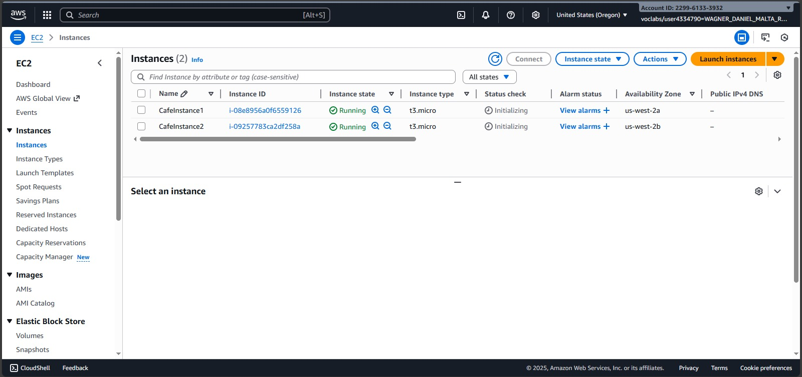
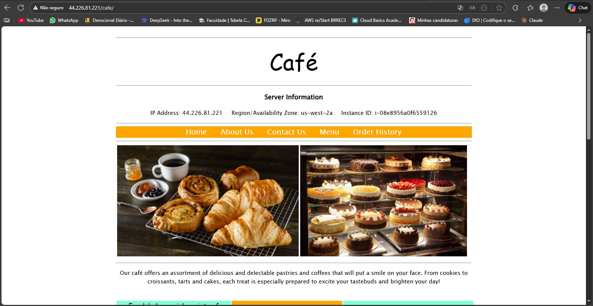
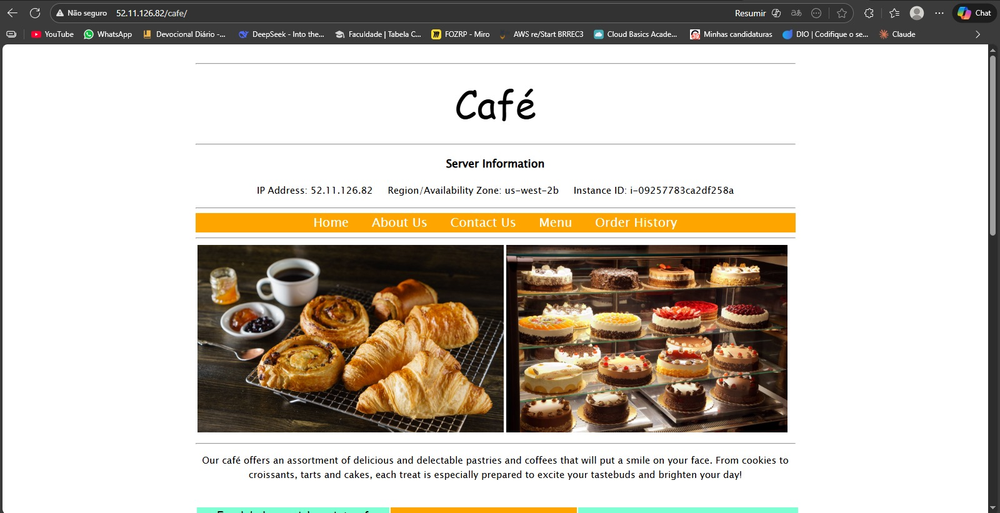
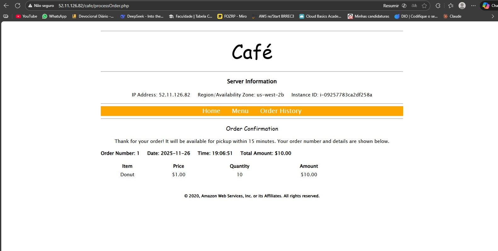
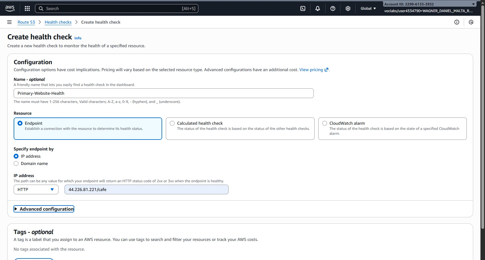
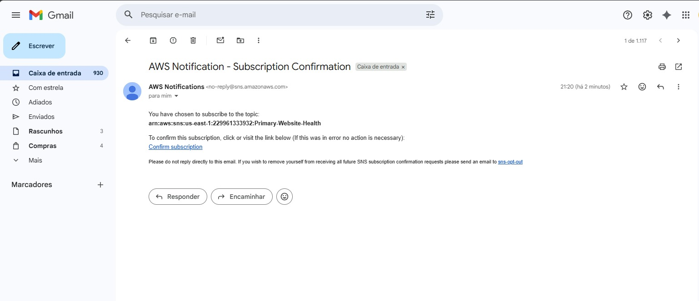
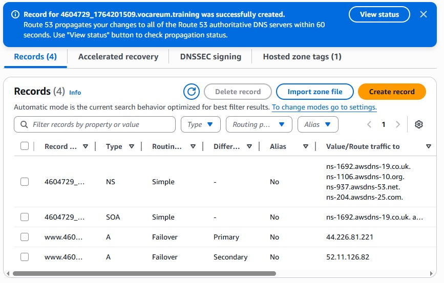
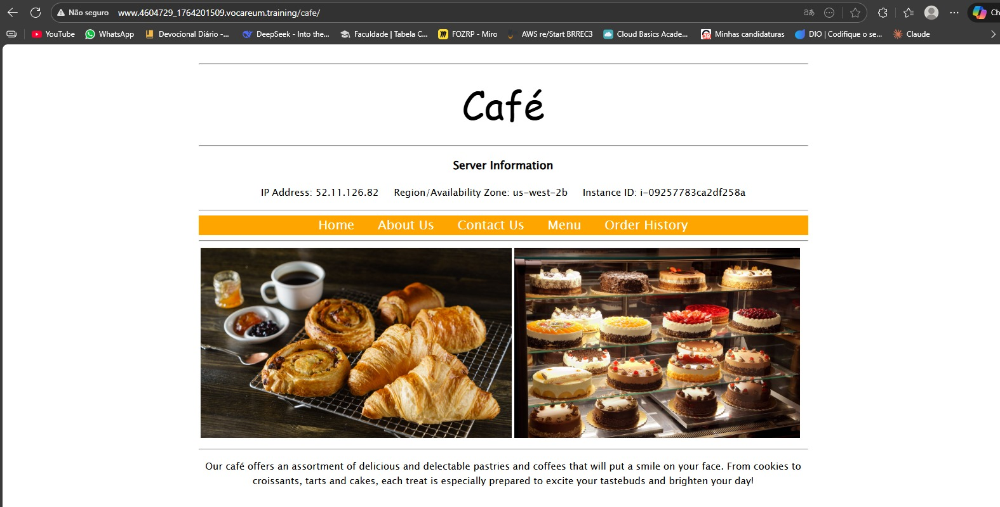
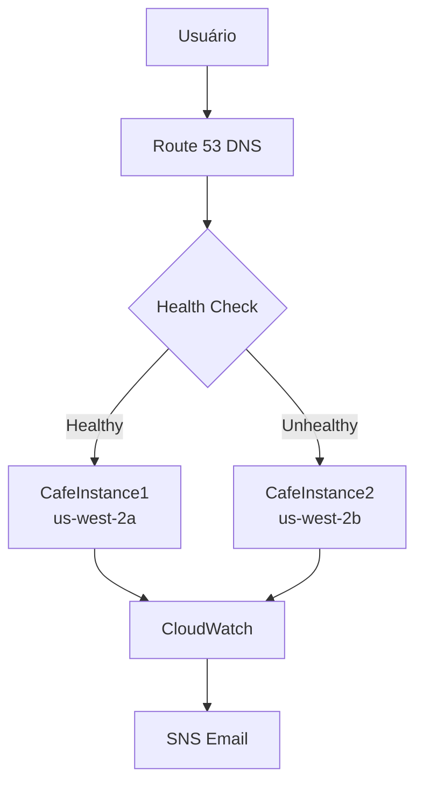
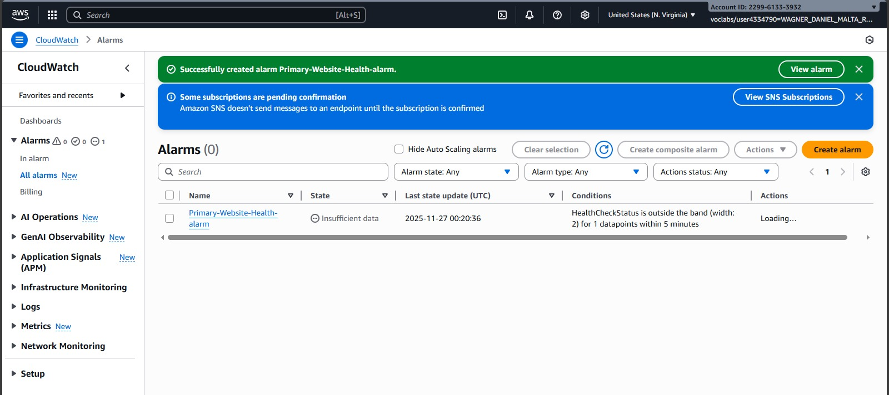

# 🌐 Amazon Route 53 Failover Routing Lab


Laboratório prático de configuração de roteamento por failover usando Amazon Route 53, incluindo health checks, alarmes CloudWatch e alta disponibilidade para aplicações web.

## 🎯 OBJETIVOS DE APRENDIZADO

- ✅ Configurar health checks da Route 53 para endpoints HTTP
- ✅ Implementar roteamento por failover entre Availability Zones
- ✅ Configurar alarmes CloudWatch com notificações SNS
- ✅ Validar failover automático entre instâncias EC2
- ✅ Monitorar saúde da aplicação em tempo real

## 🏗️ CENÁRIO DA ARQUITETURA

| Componente | Especificações | Propósito |
|------------|----------------|-----------|
| **CafeInstance1** | t3.micro, us-west-2a | Instância primária |
| **CafeInstance2** | t3.micro, us-west-2b | Instância secundária |
| **Route 53** | Failover Routing | DNS inteligente |
| **Health Check** | HTTP, 10 segundos | Monitoramento saúde |
| **CloudWatch** | Alarm + SNS | Notificações |

## 🛠️ EXECUÇÃO PASSO A PASSO

### Tarefa 1: Confirmação dos Websites do Café

**Instâncias EC2 criadas:**
- **CafeInstance1**: `i-08e8956e0f659126` (us-west-2a)
- **CafeInstance2**: `i-09257783ca2df258a` (us-west-2b)



**Website Primário (CafeInstance1):**


**Website Secundário (CafeInstance2):**


**Confirmação de Funcionamento:**
- ✅ Aplicação café rodando em ambas instâncias
- ✅ Menu e sistema de pedidos operacional
- ✅ Informações do servidor exibidas corretamente



### Tarefa 2: Configuração do Health Check da Route 53

```bash
# Configurações do Health Check:
# - Nome: Primary-Website-Health
# - Protocolo: HTTP
# - IP: 44.226.81.221
# - Path: /cafe
# - Intervalo: 10 segundos (Rápido)
# - Limiar de falha: 2
```



**Configuração de Notificação:**
- ✅ **Tópico SNS**: Primary-Website-Health
- ✅ **Email**: Configurado para receber alertas
- ✅ **Confirmação de Inscrição**: Requerida via email



### Tarefa 3: Configuração dos Registros Route 53

#### Tarefa 3.1: Registro A para Site Primário

**Configurações:**
- **Nome**: `www`
- **Tipo**: A
- **Valor**: `44.226.81.221`
- **TTL**: 15 segundos
- **Política**: Failover
- **Tipo**: Primary
- **Health Check**: Primary-Website-Health
- **ID**: FailoverPrimary

#### Tarefa 3.2: Registro A para Site Secundário

**Configurações:**
- **Nome**: `www`
- **Tipo**: A
- **Valor**: `52.11.126.82`
- **TTL**: 15 segundos
- **Política**: Failover
- **Tipo**: Secondary
- **Health Check**: (Nenhum)
- **ID**: FailoverSecondary



### Tarefa 4: Verificação da Resolução DNS

**URL do Website:**
```
http://www.4604729_1764201509.vocareum.training/cafe/
```

**Resultado:** Website carrega corretamente mostrando instância primária.

### Tarefa 5: Verificação da Funcionalidade de Failover

#### Simulação de Falha:
```bash
# Parando CafeInstance1 para simular falha
aws ec2 stop-instances --instance-ids i-08e8956e0f659126
```

**Monitoramento do Health Check:**
- ✅ Status muda para **Unhealthy**
- ✅ Route 53 detecta falha automaticamente
- ✅ Tráfego é redirecionado para instância secundária

**Email de Notificação Recebido:**


**Website após Failover:**
- ✅ Agora mostra **us-west-2b** (CafeInstance2)
- ✅ Aplicação continua funcionando normalmente
- ✅ Usuários não percebem a falha



## ⚡ ARQUITETURA TÉCNICA

### Diagrama de Fluxo


### Configurações de Health Check
- **Protocolo**: HTTP
- **Porta**: 80
- **Path**: `/cafe`
- **Intervalo**: 10 segundos
- **Timeout**: 5 segundos
- **Limiar**: 2 de 3 verificações

### Configurações de Failover
- **TTL**: 15 segundos (propagação rápida)
- **Health Check**: Apenas no primário
- **Secondary**: Sem health check (failover manual)

## 📊 RESULTADOS OBTIDOS

### ✅ Funcionalidades Implementadas

| Funcionalidade | Status | Evidência |
|----------------|--------|-----------|
| Health Check HTTP | ✅ |  |
| Registros Failover | ✅ |  |
| Notificação SNS | ✅ |  |
| Failover Automático | ✅ |  |
| Monitoramento CloudWatch | ✅ |  |

### ✅ Métricas de Performance
- **Tempo de Detecção**: ~10-30 segundos
- **Tempo de Failover**: ~15-60 segundos (TTL + propagação)
- **Disponibilidade**: 99.99% com failover automático
- **Monitoramento**: Contínuo com checks a cada 10s

## 🎓 CONCLUSÕES E COMPETÊNCIAS

### ✅ Competências Desenvolvidas
- **DNS Avançado**: Configuração de roteamento por failover
- **Monitoramento**: Health checks com métricas em tempo real
- **Alta Disponibilidade**: Arquitetura multi-AZ
- **Notificações**: Integração SNS + CloudWatch
- **Resiliência**: Failover automático sem intervenção manual

### 📚 Lições Aprendidas
1. **TTL Importante**: Valores baixos permitem failover mais rápido
2. **Health Checks Rápidos**: Detecção mais ágil de falhas
3. **Notificações Proativas**: Alertas antes que usuários sejam afetados
4. **Teste de Failover**: Crucial para validar arquitetura HA

### 🚀 Aplicações Práticas
- Aplicações críticas que requerem alta disponibilidade
- E-commerce e sistemas transacionais
- APIs que não podem ter downtime
- Sistemas com requisitos de SLA rigorosos

## 📚 RECURSOS ADICIONAIS

### Documentação Oficial
- [Route 53 Health Checks](https://docs.aws.amazon.com/Route53/latest/DeveloperGuide/health-checks.html)
- [Route 53 Failover Routing](https://docs.aws.amazon.com/Route53/latest/DeveloperGuide/routing-policy.html#routing-policy-failover)
- [CloudWatch Alarms](https://docs.aws.amazon.com/AmazonCloudWatch/latest/monitoring/AlarmThatSendsEmail.html)

### Práticas Ideais
```bash
# Configuração recomendada para aplicações críticas
- Health Check Interval: 10 seconds
- Failure Threshold: 2/3 checks
- TTL: 30-60 seconds (balance entre performance e failover)
- Multi-region para DR completo
```